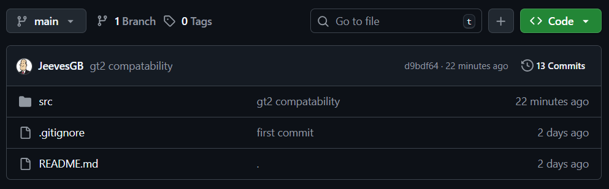
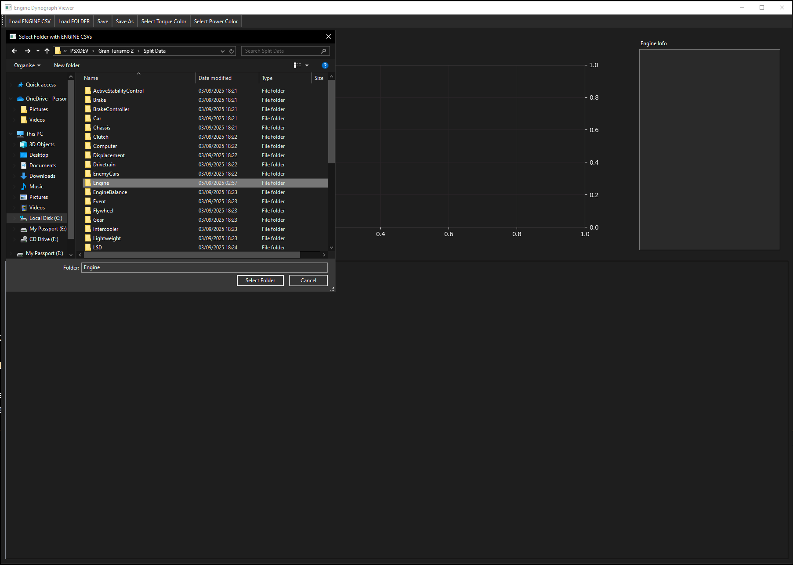

# GTDyno

A PyQt6-based tool for visualizing and editing Gran Turismo 3 engine data from CSV files.  
It features a dynograph plot, metadata display and editor for all engine fields.

---

## Contents

- [Features](#features)
- [Requirements](#requirements)
- [Installation (Windows)](#building-to-exe-windows)
- [Usage](#usage)
- [Notes](#notes)
- [Troubleshooting](#troubleshooting)
- [License](#license)

---

## Features

- Load engine CSV files and browse all engine records.
- View torque and power curves on a live matplotlib graph.
- See engine metadata at a glance.
- Edit all engine fields in a compact, grid-based editor.
- Save changes in-memory (export to CSV can be added).
- Dark mode UI.

---

## How To: (this guide assumes you have already used datasplitter)

- Download the repository by clicking the *Green* **<> Code** button and select **Download ZIP**  

- Extract the contents of the zip folder anywhere and go into the ***src*** folder, you will see two .bat files. 

- *build.bat*: This will build the python script into a working .exe file. Please note that the file size is quite large at around 100mb.
- *run-cmd.bat*: This will run the application from commandline. Notably quicker to get started as it saves waiting for the .exe to build.

- Now you have it open all you just need to navigate to your *Engine* folder. 

- Once loaded you will see a list of cars as they're named within the .csv file, select one to view their information in the box below. 

---
## Requirements

- Python 3.10+ (tested with 3.11/3.12/3.13)
- [PyQt6](https://pypi.org/project/PyQt6/)
- [matplotlib](https://pypi.org/project/matplotlib/)
- [pandas](https://pypi.org/project/pandas/)

---

## Building to .exe (Windows)

1. **Install PyInstaller**  
   Download "src" folder.
2. **Run .bat**
   Run either build.bat (Builds a .exe LARGE FILE SIZE) or run-cmd.bat (Runs the script from command prompt).

## Usage

1. Click **"Load ENGINE CSV"** in the toolbar and select your engine data CSV file.
2. Select an engine from the list on the left.
3. View the dynograph and metadata on the right.
4. Edit any field in the grid editor at the bottom.
5. Click **"Save"** in the toolbar to apply your changes in memory.

---

## Notes

- Changes are kept in memory. To export, you can add a "Save to CSV" feature or use pandas' `to_csv()` in the code.
- The editor enforces numeric types for numeric fields.
- The UI is optimized for Windows and dark mode.

---

## Troubleshooting

- If you get errors about missing modules, ensure you installed all dependencies with `pip install PyQt6 matplotlib pandas`.
- If you have multiple Python versions, use `py -3 gtd.py` or specify the full path to your Python executable.

---
